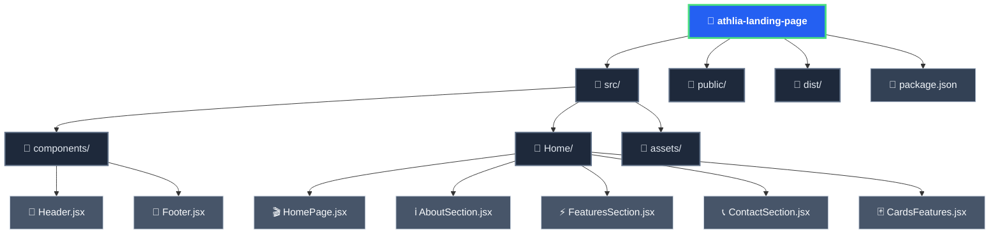

# 🚀 Athlia Landing Page

<div align="center">


*Une expérience visuelle futuriste au cœur du fitness de demain* ✨

[](https://Knarta.github.io/Athlia_landing_page)
[](https://github.com/Knarta/Athlia_landing_page)

</div>

---

<div align="center">

## 🌟 L'Univers Visuel d'Athlia

</div>

<div align="center">

Une landing page moderne et immersive où **technologie** et **bien-être** fusionnent dans un univers digital élégant.

</div>

<div align="center">

### 🎨 Palette Chromatique

</div>

<div align="center">

| Couleur | Code | Signification | Émoji |
|:-------:|:----:|:-------------:|:-----:|
| 🔵 Bleu électrique | `#2460f2` | Énergie et technologie | ⚡ |
| 🟢 Vert néon | `#4ade80` | Vitalité et croissance | 🌱 |
| ⚫ Noir profond | `#0f172a` | Mystère et élégance | 🌙 |
| ⚪ Blanc translucide | `rgba(255,255,255,0.9)` | Pureté et modernité | ✨ |

</div>

<div align="center">

### ✨ Effets Visuels Immersifs

</div>

<div align="center">

| Effet | Description | Animation |
|:-----:|:-----------:|:---------:|
| 🌊 **Gradients animés** | Transitions fluides entre couleurs | `gradientShift` |
| 🔄 **Morphing shapes** | Formes géométriques évolutives | `morphingShape` |
| 💫 **Light trails** | Traînées lumineuses interactives | `lightTrail` |
| ⚡ **Energy pulse** | Ondes d'énergie dynamiques | `energyPulse` |
| 🎭 **Parallax layers** | Profondeur et mouvement | `parallaxSlow` |
| 🪟 **Glassmorphism** | Transparences et flous artistiques | `backdrop-filter` |

</div>

<div align="center">

### 🌟 Animations Avancées

</div>

<div align="center">

| Animation | Type | Durée | Effet |
|:---------:|:----:|:-----:|:-----:|
| 🌈 **Gradient shift** | Arrière-plan en mouvement perpétuel | 20s | Mouvement fluide |
| 🔮 **Morphing orbs** | Sphères lumineuses transformatives | 15s | Transformation |
| 🌊 **Liquid waves** | Vagues organiques fluides | 12s | Ondulation |
| ✨ **Interactive particles** | Particules réactives au hover | 20s | Interaction |
| 🎈 **Floating elements** | Éléments en lévitation | 8s | Flottement |

</div>

---

<div align="center">

## 🎯 L'Expérience Utilisateur

</div>

<div align="center">

### 🎬 Hero Section Immersive

</div>

<div align="center">

| Élément | Fonctionnalité | Effet Visuel |
|:-------:|:-------------:|:------------:|
| 📹 **Vidéo 4K** | Arrière-plan avec overlay dynamique | Overlay animé |
| ✍️ **Typographie animée** | Effets de lueur et glow | Text-shadow |
| 🎯 **Bouton CTA futuriste** | Animations fluides | Hover effects |
| ⬇️ **Scroll indicator** | Interactif et lumineux | Float animation |

</div>

<div align="center">

### 📱 Sections Visuelles

</div>

<div align="center">

| Section | Contenu | Effet Spécial |
|:-------:|:-------:|:------------:|
| ℹ️ **About** | Présentation avec effets de profondeur | Parallax |
| ⚡ **Features** | Cartes avec hover effects et icônes animées | Transform |
| 📞 **Contact** | Formulaire avec validation temps réel | Validation |

</div>

<div align="center">

### 📐 Responsive Design

</div>

<div align="center">

| Plateforme | Adaptation | Performance |
|:----------:|:----------:|:-----------:|
| 📱 **Mobile** | Adaptation parfaite des effets | Optimisée |
| 📱 **Tablet** | Expérience optimisée | Fluide |
| 💻 **Desktop** | Effets complets et immersifs | Complète |

</div>

---

<div align="center">

## 🛠️ Technologies Visuelles

</div>

<div align="center">

### 🎨 CSS3 Avancé

</div>

<div align="center">

| Technique | Utilisation | Exemple |
|:---------:|:-----------:|:-------:|
| 🎭 **Animations complexes** | Keyframes personnalisées | `@keyframes morphingShape` |
| 🎪 **Effets de profondeur** | Box-shadow et filters | `filter: blur(4px)` |
| ⚡ **Transitions fluides** | Cubic-bezier timing | `cubic-bezier(0.4, 0, 0.2, 1)` |
| 🌈 **Gradients dynamiques** | Linear et radial gradients | `linear-gradient(135deg, ...)` |

</div>

<div align="center">

### ⚛️ React 19 + Vite

</div>

<div align="center">

| Technologie | Avantage | Performance |
|:-----------:|:--------:|:-----------:|
| 🚀 **React 19** | Performance optimale, rendu dynamique | Ultra-rapide |
| ⚡ **Vite** | Build ultra-rapide, expérience fluide | Instantané |
| 🔄 **HMR** | Développement en temps réel | Hot reload |

</div>

---

<div align="center">

## 🏗️ Architecture Technique

</div>

<div align="center">



</div>

---

<div align="center">

## 🚀 Installation & Immersion

</div>

<div align="center">

```bash
# 🎯 Cloner le repository
git clone https://github.com/Knarta/Athlia_landing_page.git
cd Athlia_landing_page

# 📦 Installer les dépendances
npm install

# ✨ Plonger dans l'expérience immersive
npm run dev
```

</div>

---

<div align="center">

## 🎮 Scripts Disponibles

</div>

<div align="center">

| Commande | Description | Emoji | Statut |
|:--------:|:-----------:|:-----:|:------:|
| `npm run dev` | Immersion en développement | 🚀 | ✅ Actif |
| `npm run build` | Construction pour production | 🏗️ | ✅ Actif |
| `npm run preview` | Aperçu de l'expérience | 👀 | ✅ Actif |
| `npm run deploy` | Déploiement sur GitHub Pages | 🚀 | ✅ Actif |

</div>

---

<div align="center">

## 🌐 Déploiement

</div>

<div align="center">

[](https://Knarta.github.io/Athlia_landing_page)

**URL de production** : https://Knarta.github.io/Athlia_landing_page

L'expérience est déployée sur GitHub Pages avec optimisation automatique pour une performance maximale.

</div>

---

<div align="center">

## 📱 Compatibilité

</div>

<div align="center">

| Plateforme | Statut | Détails | Performance |
|:----------:|:------:|:-------:|:-----------:|
| 🖥️ **Desktop** | ✅ | Chrome, Firefox, Safari, Edge | Effets complets |
| 📱 **Mobile** | ✅ | iOS Safari, Chrome Mobile | Adaptation responsive |
| 📱 **Tablet** | ✅ | iPad, Android | Expérience optimisée |
| ⚡ **Performance** | ✅ | Chargement rapide, animations fluides | Optimale |

</div>

---

<div align="center">

## 👥 Contact

</div>

<div align="center">

**Développeur** : Brenda - Hilliass & Charlène  
**Repository** : [GitHub](https://github.com/Knarta/Athlia_landing_page)  
**Site Web** : [Live Demo](https://Knarta.github.io/Athlia_landing_page)

</div>

---

<div align="center">

*✨ Propulsé par la technologie de demain - L'avenir du fitness est ici ✨*

</div>
